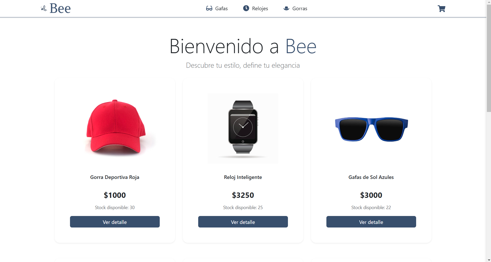
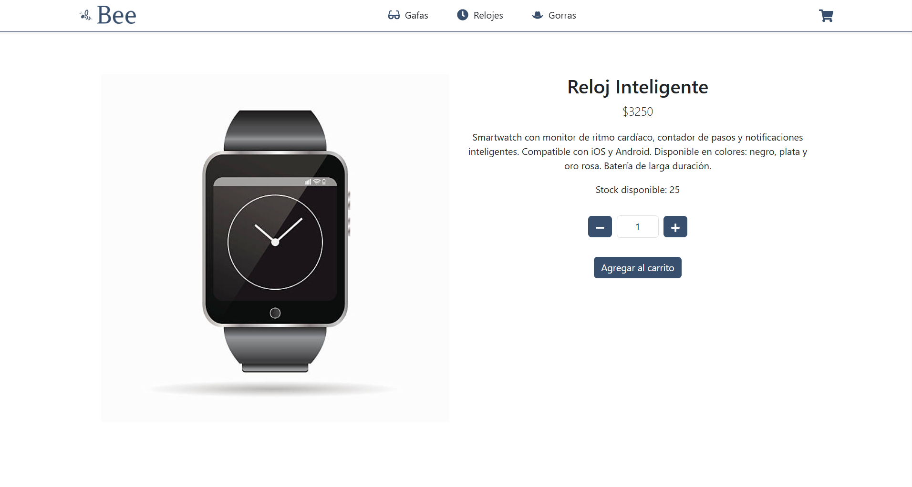
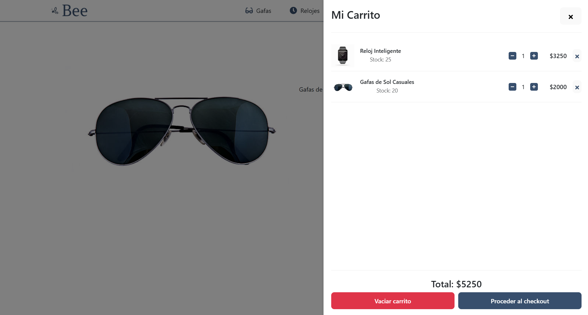
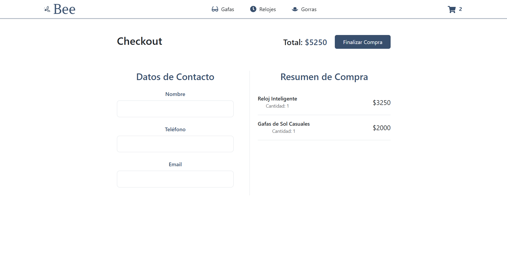
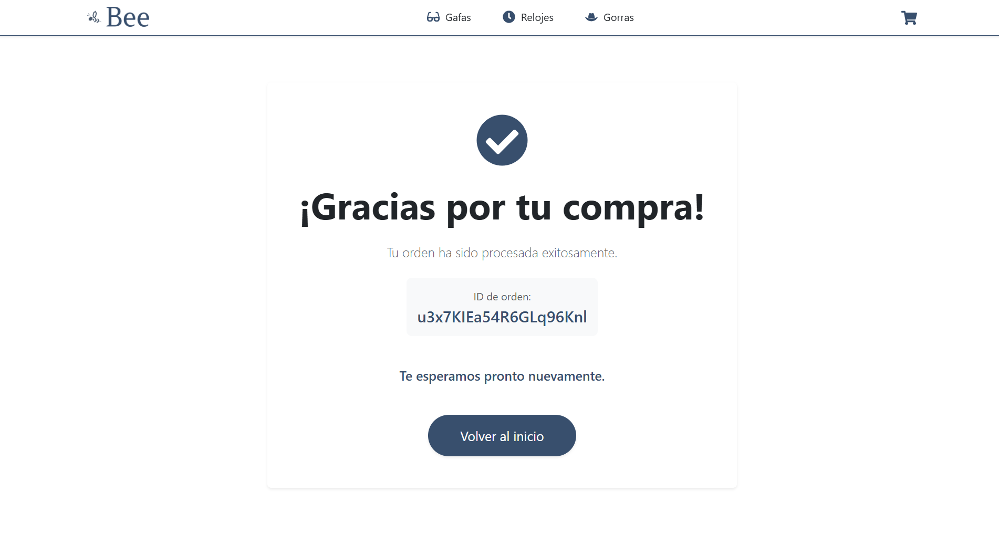

# Proyecto Final React

## Reseña del proyecto

BEE es un e-commerce especializado en la venta de accesorios para hombres, ofreciendo una selección cuidadosamente curada de relojes, gorras y gafas. La plataforma está diseñada con un enfoque minimalista y una experiencia de usuario intuitiva.

## Tecnologias utilizadas:

- React Router Dom v
- Firebase v
- React Icons
- Toastify
- React Bootstrap

## Caracteristicas principales:

1. Código optimizado y mantenible
2. Implementación de principios SOLID
3. Buenas prácticas de desarrollo
4. Diseño responsivo
5. Gestión de estado global
6. Integración con Firebase

## Nuestro E-Commerce

#### Visita nuestra pagina web: [Bee - Accesorios para hombres](https://harmonious-marigold-87e80c.netlify.app/)

## Capturas de pantalla

### Página Principal

*Interfaz principal con navegación y vista del catálogo*

### Detalle de Producto

*Página de detalle con información completa del producto*

### Carrito de Compras

*Carrito de compras con resumen de productos seleccionados*

### Checkout

*Proceso de checkout para finalizar la compra*

### Orden Completasa

*Proceso de orden completada con el id de la compra*

## Trabajado por:
_Joseph Hernandez💻🧔🏻‍♂️_
